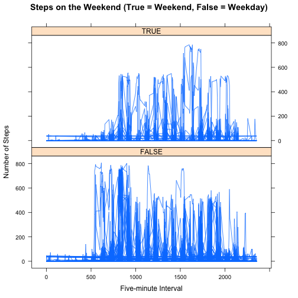

###Loading the data.
First I load the data.


```r
setwd("~/github_repo/RepData_PeerAssessment1")
actset <- read.csv("activity.csv")
```

###Number of steps taken per day

Here we calculate the total number of steps in each day and graphically display that information in a histogram. We are ignoring missing values.


```r
stepsPerDay <- as.data.frame(tapply(actset$steps, INDEX = actset$date, FUN = "sum", na.rm = TRUE))
colnames(stepsPerDay) <- "steps"
hist(stepsPerDay$steps,main="Figure 1. Total Steps Per Day",xlab = "Number of Steps Per Day")
```

 

Using that same data, here we calculate the mean and median total number of steps taken per day.


```r
meanSteps <-   mean(stepsPerDay$steps, na.rm = TRUE)
medianSteps <- median(stepsPerDay$steps, na.rm = TRUE)
```

The mean number of steps per day is 9354.2295082 and the median number of steps per day is 10395. [Aside: I wish I knew how to format these passed variables. It's not ideal here but it gets worse later!]

###Average Daily Activity Pattern

Here I will make a time series plot of the 5-minute interval (x-axis) and the average number of steps taken in each interval, averaged across all days (y-axis).


```r
meanStepsPerInt <- as.data.frame(tapply(actset$steps,INDEX = actset$interval,FUN = "mean", na.rm = TRUE))
colnames(meanStepsPerInt) <- "meanStepsPerDay"
meanStepsPerInt$interval <- rownames(meanStepsPerInt)
plot(meanStepsPerInt$interval, meanStepsPerInt$meanStepsPerDay,type="l",main="Average Number of Steps by Time Interval",xlab="Five minute periods",ylab="Average Steps (N)")
```

 

```r
# find max for summary statement
maximum <- (meanStepsPerInt$meanStepsPerDay == max(meanStepsPerInt$meanStepsPerDay))
maxMean <- meanStepsPerInt[maximum, ]
intervalMax <- maxMean[1, 2]
```

As can be seen in the time series plot, the 5-minute interval, that contains the maximum number of steps on average is interval # 835.

###Imputing missing values

Note that there are a number of days/intervals where there are missing values (coded as NA). I will explore whether the presence of missing days introduces bias into this analysis.

First, I will calculate and report the total number of missing values in the dataset (i.e. the total number of rows with NAs).


```r
numberNAs <- summary(is.na(actset$steps))
numberNA  <- as.numeric(numberNAs[3])
```

The total number of rows with NAs is 2304

To assign a value to each missing value in the dataset I will use the mean for all five-minute intervals for the entire dataset using the [Hmisc package's impute function](http://www.inside-r.org/packages/cran/Hmisc/docs/impute). 


```r
library(Hmisc)
actsetImputed <- actset
actsetImputed$steps <- with(actsetImputed, impute(steps, mean))
totalStepsImputed <- tapply(actsetImputed$steps,actsetImputed$date, sum)
meanStepsImputed <- mean(totalStepsImputed)
medianStepsImputed <- median(totalStepsImputed)

hist(totalStepsImputed,main="Total Steps Per Day, with Imputed Values for NA",xlab = "Number of Steps Per Day")
```

 

Comparing Figure 1 (original data with NAs) with Figure 2 (imputed data for NAs) we can see that imputing data in this particular manner causes an increase in the total number of steps per day. This is borne out when comparing the means and medians:

The mean ignoring NAs was 9354.2295082 whereas with imputing NAs it is 1.0766189 &times; 10<sup>4</sup>.
The median ignoring NAs was 10395 whereas with imputing NAs it is 1.0766189 &times; 10<sup>4</sup>. [Aside: This is ugly. I can't figure out how to change the number format of these passed variables so that both sets display similarly - they are similar figures but for some reason one number displays normally and the other in scientific format. DANG... Sorry!).

It is not surprising that the imputed are higher considering we are replacing missing values with the mean which is obviously higher than a missing value. It is difficult to say whether or not missing measurements or NAs introduce bias. If for example they represent periods of inactivity, such as the middle of the night when subjects are asleep, then the dataset with NAs are likely a better representation of step patterns.

##Activity patterns on weekdays vs weekends

To explore whether there's a difference between the number of steps on weekend days versus week days I'll add whether or not each day is a weekend day or not. Weekend days are conveniently the only days that begin with 'S' so I will use GREP to mark these records as weekend days. Then I'll create a panel plot that allows us to compare steps in each day type one over the other.


```r
isWeekend <- grepl("^[Ss]", weekdays(as.Date(activity$date)))
actsetImputed$dayType <- isWeekend
weekends <- subset(actsetImputed, dayType==TRUE)
weekdays <- subset(actsetImputed, dayType==FALSE)

meanStepsPerIntWkEnd <- as.data.frame(tapply(weekends$steps,INDEX = weekends$interval,FUN = "mean"))
meanStepsPerIntWkDay <- as.data.frame(tapply(weekdays$steps,INDEX = weekdays$interval,FUN = "mean"))

library(datasets)
actsetImputedWeek <- transform(actsetImputed, isWeekend = factor(isWeekend))

library(lattice)
xyplot(steps ~ interval | isWeekend,data=actsetImputedWeek,type="l",main="Steps on the Weekend (True = Weekend, False = Weekday)",xlab="Five-minute Interval",ylab="Number of Steps",layout=c(1,2))
```

 

Although the number of steps on weekend days and on weekdays looks similar, there appear to be a greater number of intervals in weekend days that have a higher number of steps. I apologize that this chart is ugly - I ran out of time. Hopefully this captures the gist. 

Thanks!
